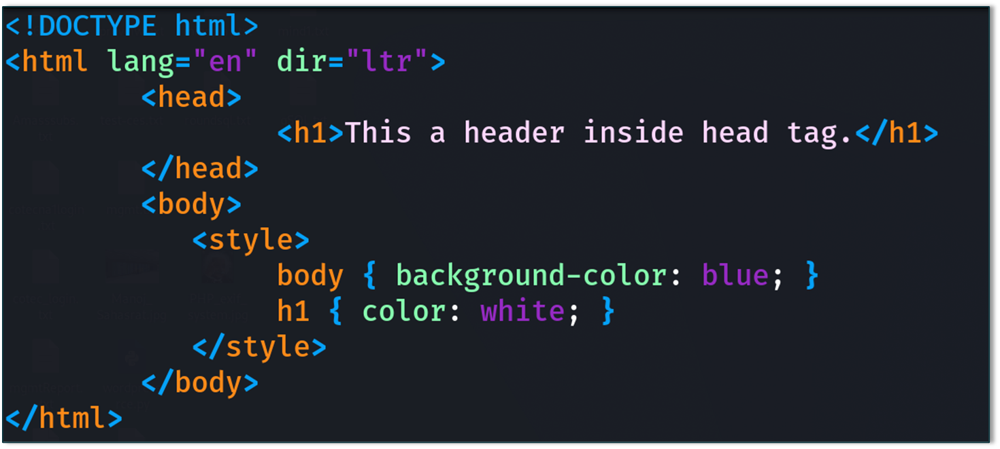

# HTML Injection
### What is HTML Injection? 
HTML injection is a Vulnerability which occurs in web applications that allow users to insert html code via specific parameter for example or an entry point.

### Exploited with
Social Engineering in order to trick valid users of the application to open malicious websites or to insert their credentials in a fake login form that it will redirect the users to a page that captures and credentials.
### Imapct
When the input fields are not properly sanitized over in a webpage, thus sometimes this HTML Injection vulnerability might lead us to Cross-Site Scripting(XSS) or Server-Side Request Forgery(SSRF) attacks. 

Therefore this vulnerability has been reported with Severity Level as “Medium”
### Types
#### Reflected HTML Injection
- The malicious HTML code is included in the request (e.g., via URL or form input).

- Reflected immediately back in the server's response without proper sanitization.

- Exists only during that request — not stored.

- Example: `https://example.com/search?q=<h1>Hacked</h1>`

#### Stored HTML Injection
- The malicious HTML is permanently stored in the server’s database or files (e.g., in comments, profiles).

- Every time someone views the affected page, the injected HTML is rendered.

- More dangerous than reflected as it affects all users.